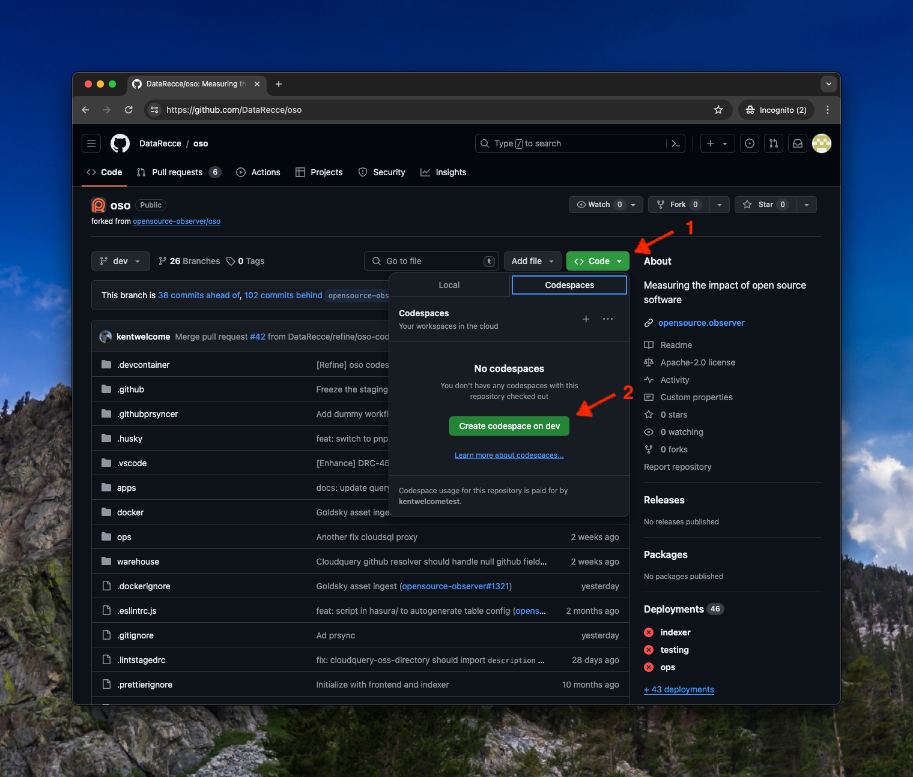
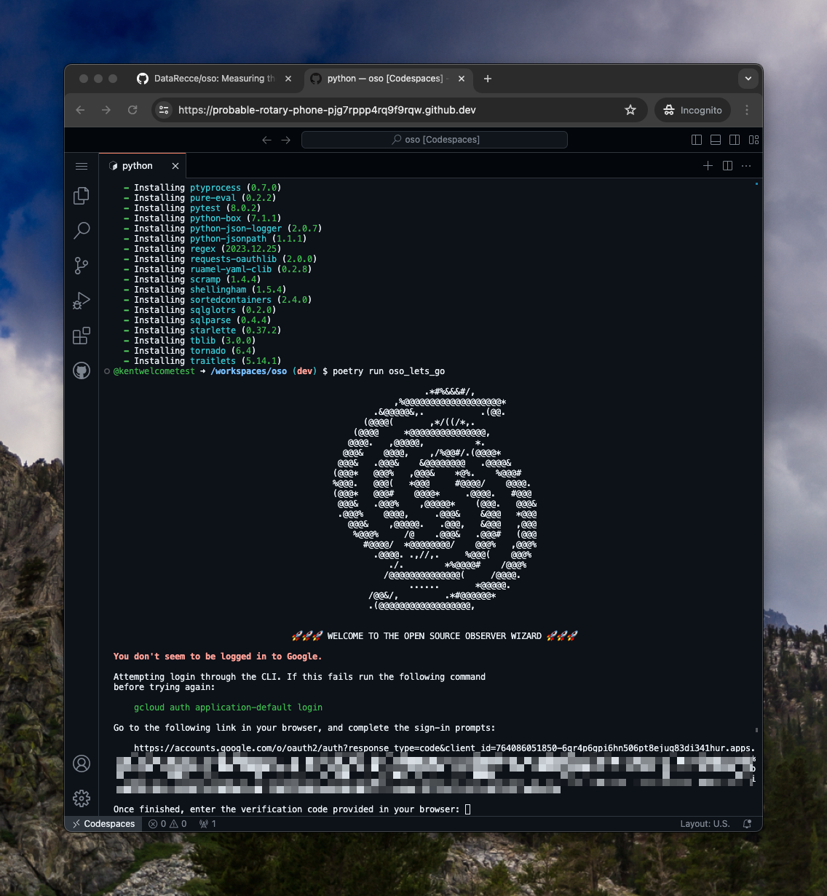

# How to run OSO (OpenSource Observer) in the GitHub Codespaces

GitHub Codespaces is a feature that allows you to develop the repository in the cloud. This is a guide on how to run the Open Source Observer repository in GitHub Codespaces directly.

## Prepare the Data Warehouse of OSO
To run the OSO repository in GitHub Codespaces, you need to prepare the data warehouse of OSO on your own GCP BigQuery. You can also follow the [Get-Stated](https://docs.opensource.observer/docs/get-started/) document on the OSO website to prepare the data warehouse.
Or you can follow the following steps to prepare your data warehouse by GitHub Codespaces.

### Configure your GCP Project with OSO data set by GitHub Codespaces
1. Fork the OSO repository to your GitHub account.
1. Make sure you have GCP account with BigQuery read/write access permission.

    If you don't have GCP account, please reference [Get Started with Google Cloud Platform](https://console.cloud.google.com/getting-started?pli=1) to create a GCP account with 90-day, $300 free trial.

1. Launch a GitHub Codespaces with the OSO repository `dev` branch.
    

1. Open the terminal in the Codespaces and run the following command to set up OSO data set in your GCP project.
    ```bash
    poetry install
    poetry run oso_lets_go
    ```

1. Once the command `poetry run oso_lets_go` is executed, you will be asked to log in to your GCP account. Please follow the instructions to log in to your GCP account.
    

1. After logging in to your GCP account, you will be asked to select the GCP project you want to use for the OSO data set. Please select the GCP project you want to use for the OSO data set.

1. After selecting the GCP project, you will be asked to select the BigQuery dataset you want to use for the OSO data set. Please select an existing BigQuery dataset or create a new dataset. 
    We suggest you can use name `oso_playground` for the base BigQuery dataset.

1. Once the BigQuery dataset is selected, the OSO data set will be set up in your GCP project and create corresponding BigQuery table. Please don't execute the dbt in this step when the wizard asks you to execute dbt. We still need to set up some environment variables before running dbt.

1. Execute the `oso_lets_go` again to set up the development BigQuery dataset. The development BigQuery dataset is used for the development environment of OSO. We suggest you can use name `oso_playground_dev` for the development BigQuery dataset.
    ```bash
    poetry run oso_lets_go
    ```
    When the wizard asks you to execute dbt, please don't execute dbt in this step. We still need to set up some environment variables before running dbt.

1. Once the wizard is completed, it will show the generated dbt profile. Please copy the path of keyfile and set the environment variable `DBT_GOOGLE_KEYFILE`
    ```bash
    export DBT_GOOGLE_KEYFILE=<path-to-keyfile>
    ```

1. Set the environment variable `DBT_GOOGLE_PROJECT` with your GCP project.
    ```bash
    export DBT_GOOGLE_PROJECT=<your-gcp-project-id>
    export DBT_GOOGLE_DATASET=oso_playground
    export DBT_GOOGLE_DEV_DATASET=oso_playground_dev
    ```

1. Execute the dbt to build the both environments.
    ```bash
    dbt build --target playground --target-path target-base
    dbt docs generate --target playground --target-path target-base
    dbt build --target dev
    dbt docs generate --target dev
    ```

1. Launch the Recce inside the Codespaces to diff the dbt models in the `playground` and `dev` environment.
    ```bash
    recce server
    ```
    Once the Recce server is launched, the Codespaces will pop up a new browser tab with the Recce UI. You can use the Recce UI to diff the dbt models in the `playground` and `dev` environment. 

### Configure the Codespaces Secret for the Environment Variables

Once you have set up the GCP project and BigQuery dataset, you can put your settings in the personal Codespaces secret. Therefor, you don't need to set the environment variables every time you launch the Codespaces.

1. Open the Codespaces secret setting by clicking the `Settings` button in the GitHub Page.

1. Select the `Codespaces` tab and click the `Add secret` button.
    You need to add the following secrets:
    - `DBT_GOOGLE_PROJECT`: Your GCP project ID.
    - `GOOGLE_CLOUD_SERVICE_ACCOUNT_KEY_CONTENT`: The content of the google service account key file.
    - `DBT_GOOGLE_DATASET`: The BigQuery dataset for the OSO data set.
    - `DBT_GOOGLE_DEV_DATASET`: The BigQuery dataset for the development environment of OSO.

    Please make sure the Codespaces secret is applied to your forked repository.

1. Once the Codespaces secret is set up, you can launch the Codespaces with the OSO repository and the Codespaces will automatically set the environment variables for you.


